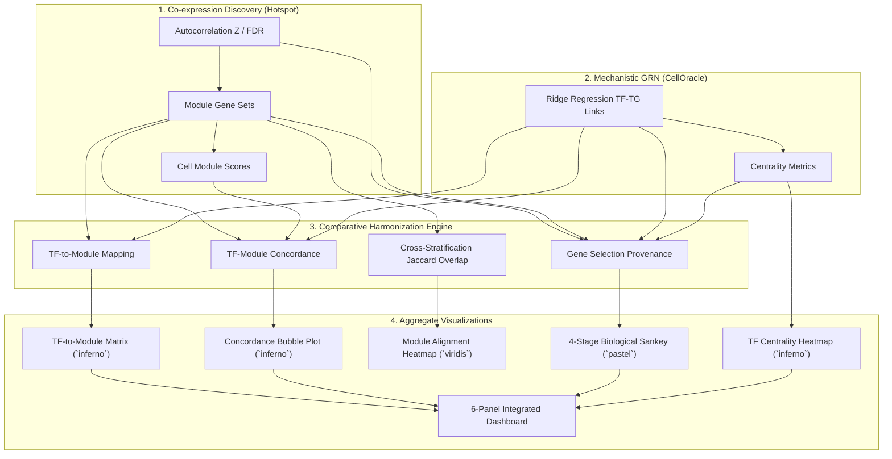

# Comparative & Aggregation Analysis
{: .no_toc }

GeneCircuitry provides a unified cross-cluster and cross-stratification comparative analysis engine that bridges **unsupervised gene co-expression modules (Hotspot)** with **mechanistic gene regulatory networks (CellOracle)**.

## Table of contents
{: .no_toc .text-delta }

1. TOC
{:toc}

---

## 1. Overview & Core Philosophy

Single-cell transcriptomics experiments often span multiple cell types (clusters) and experimental conditions (stratifications, such as *Control vs. Disease*, *Wild Type vs. Knockout*, or distinct donor cohorts). 

Analyzing individual cell states in isolation leaves critical questions unanswered:
- **Which cellular gene programs are conserved across cell types versus condition-specific?**
- **Which Master Transcription Factors drive each co-expression module?**
- **Do transcription factors maintain constant targets or rewire their regulatory scope?**
- **How do Hotspot modules from separate conditions align when they share the same numeric ID?**

GeneCircuitry automatically integrates these outputs into publication-ready aggregate figures.



---

## 2. The Module ID Collision Problem & Jaccard Alignment

### The Problem
Hotspot discovers co-expression modules independently per run and numbers them sequentially (`Module 1`, `Module 2`, ...). 
- `Control: Module 1` (e.g. *ISG15, IFIT1, OAS1* — Interferon Response)
- `Treated: Module 1` (e.g. *CDK1, TOP2A, PCNA* — Cell Cycle)
- `Treated: Module 2` (e.g. *ISG15, IFIT1, MX1* — Interferon Response)

Comparing `Module 1` across conditions purely by numeric label would falsely compare Interferon genes with Cell Cycle genes.

### The GeneCircuitry Solution
GeneCircuitry extracts module gene sets under their full provenance `(Stratification, Module)` and computes pairwise gene set overlap matrices:

1. **Jaccard Similarity Matrix**:
   $$J(M_{A, i}, M_{B, j}) = \frac{|M_{A, i} \cap M_{B, j}|}{|M_{A, i} \cup M_{B, j}|}$$

2. **Overlap (Simpson) Coefficient Matrix**:
   $$O(M_{A, i}, M_{B, j}) = \frac{|M_{A, i} \cap M_{B, j}|}{\min(|M_{A, i}|, |M_{B, j}|)}$$

3. **Alignment Classification Table** (`cross_stratification_module_alignment.csv`):
   - **Conserved Program (High Overlap)**: $J \ge 0.30$ or $O \ge 0.50$ (e.g., `Control: M1` $\leftrightarrow$ `Treated: M2`)
   - **Related Program (Partial Overlap)**: $J \ge 0.15$ or $O \ge 0.25$
   - **Condition-Specific / Distinct**: $J < 0.15$

---

## 3. Visualization Catalog & Interpretation

### 1. Module Activity Heatmap (Row-Standardized Z-Score)
- **Function**: `plot_comparative_module_activity()`
- **Colormap**: `viridis`
- **Formula**:
  $$Z_{m, k} = \frac{\bar{S}_{m, k} - \mu_m}{\sigma_m}$$
- **Interpretation**: Row Z-scoring normalizes for module size differences. Bright yellow indicates cell-state specific upregulation; dark purple indicates quiescence or downregulation.

---

### 2. Cross-Stratification Module Gene Alignment Heatmap
- **Function**: `plot_cross_stratification_module_overlap()`
- **Colormap**: `viridis`
- **Interpretation**: Visualizes pairwise Jaccard similarity across modules from different conditions. Directly highlights conserved programs on the off-diagonals and flags condition-specific modules.

---

### 3. TF-to-Module Regulatory Matrix
- **Function**: `plot_tf_module_regulatory_matrix()`
- **Colormap**: `inferno`
- **Formula**: Target overlap count $N(T, M_j) = |\text{Targets}(T) \cap M_j|$.
- **Interpretation**: Identifies which transcription factors bind to and regulate each co-expression module. TFs are ranked by total targets across all modules.

---

### 4. TF-to-Module Regulatory Concordance (Bubble Matrix)
- **Function**: `plot_tf_module_concordance()`
- **Colormap**: `inferno`
- **Visual Dimensions**:
  - **X-axis**: Cluster / Cell State
  - **Y-axis**: Co-expression Module
  - **Bubble Size**: Module target coverage ($\%$ of module genes regulated by the top TF)
  - **Bubble Color**: Mean module expression score
  - **Text Label**: Master Driver TF name + coverage percentage (e.g. `STAT1 (85%)`)
- **Interpretation**: Simultaneously reveals whether a module is active in a cluster and which master TF is responsible for driving its expression.

---

### 5. Gene Selection Provenance (4-Stage Biological Sankey)
- **Function**: `plot_gene_selection_sankey()`
- **Palette**: Soft pastel (`pastel`)
- **Flow Stages**:
  1. **Hotspot Modules**: Co-expression origin (`Module 1`, `Module 2`, ..., `Unassigned`).
  2. **GRN Master Drivers**: CellOracle regulatory role (`Target of STAT1`, `Target of MYC`, `Master TF`, `Multi-TF Hub Target`, `Non-GRN Target`).
  3. **Cell-State Context**: Activation scope (`Cluster 0 Specific`, `Cluster 1 Specific`, `Conserved Across All Clusters`).
  4. **Enriched Pathways**: Downstream functional program (e.g. *Interferon Signaling*, *Cell Cycle & Mitosis*).
- **Interpretation**: Traces the complete biological journey of every gene through the pipeline.

---

### 6. Transcription Factor Centrality Heatmap
- **Function**: `plot_comparative_tf_centrality()`
- **Colormap**: `inferno`
- **Classification**:
  - $\bigstar$ **Global Master Regulators**: TFs with top 15% centrality across $>70\%$ of groups (core lineage factors).
  - $\blacklozenge$ **Group-Specific Regulators**: TFs with high centrality in $\le 30\%$ of groups (state-specific activation drivers).

---

### 7. TF Target Gene Conservation vs. Rewiring
- **Function**: `plot_differential_tf_targets()`
- **Palette**: Pastel Blue (Conserved) & Pastel Coral (Rewired)
- **Interpretation**: Measures whether a transcription factor regulates a fixed set of core targets across conditions or dynamically rewires its target repertoire under perturbation.

---

### 8. Cross-Cluster Regulatory Scale (2x2 Multi-Panel)
- **Function**: `plot_cross_cluster_regulatory_comparison()`
- **Panels**: Grouped bars for total edges and unique targets, active TFs and modules, and formatted summary tables of top TFs and top regulatory circuits ($TF \rightarrow TG$).

---

### 9. Integrated Regulatory Dashboard (6-Panel Composite)
- **Function**: `plot_integrated_regulatory_dashboard()`
- **Layout**: 3x2 composite figure combining Module Activity, TF-to-Module Mapping, TF Centrality, Gene Provenance Breakdown, Regulatory Scale, and Top Module Drivers.

---

## 4. Visual Encoding Guidelines

| Data Context | Recommended Colormap / Palette | Purpose |
| :--- | :--- | :--- |
| **Regulatory Intensity & Centrality** | `inferno` | Radiance highlights hubs and strong binding. |
| **Continuous Scores & Overlaps** | `viridis` | Perceptually uniform for expression and Jaccard metrics. |
| **Categorical Bars, Violins, Flows** | `pastel` (`Set2`, `Pastel1`) | Soft, delicate tones for high legibility without visual clutter. |

---

## 5. Output Files & Tables

Comparative analysis outputs are saved under `results/comparative/`:

| File Name | Format | Description |
| :--- | :--- | :--- |
| `module_activity_matrix.csv` | CSV | Mean module expression scores per cluster/stratification |
| `cross_stratification_module_jaccard.csv` | CSV | Pairwise Jaccard similarity matrix across condition modules |
| `cross_stratification_module_alignment.csv` | CSV | Summary table of aligned module pairs and conservation status |
| `tf_to_module_matrix.csv` | CSV | TF-to-module target count matrix |
| `tf_to_module_mapping.csv` | CSV | Ranked table of top TFs per co-expression module |
| `tf_centrality_matrix.csv` | CSV | Degree centrality scores across groups |
| `tf_specificity_summary.csv` | CSV | Master vs. Group-Specific TF classifications |
| `differential_tf_targets.csv` | CSV | Conserved vs. rewired target counts per TF |
| `gene_selection_provenance.csv` | CSV | Gene-by-gene tracing (Hotspot $\rightarrow$ Modules $\rightarrow$ GRN $\rightarrow$ Pathways) |
| `cross_cluster_regulatory_summary.csv` | CSV | Network edge counts, active TFs, and top regulatory circuits |
| `tf_module_concordance.csv` | CSV | Module activity and top driver TF concordance scores |

---

## 6. Python API Usage

```python
from genecircuitry.comparative_analysis import run_comparative_analysis
from genecircuitry.plotting.comparative_plots import generate_all_comparative_plots

# Run comparative analysis across stratifications or clusters
comparative_results = run_comparative_analysis(
    adata=adata,
    links_df=links_df,
    score_df=score_df,
    hotspot_obj=hotspot_obj,
    stratification_results=controller.stratification_results,
    output_dir="results/",
    cluster_key="leiden",
    save_tables=True,
)

# Generate all 10 comparative and aggregate visualizations
plot_status = generate_all_comparative_plots(
    comparative_results,
    save_name="experiment_1",
    skip_existing=False,
)
```

